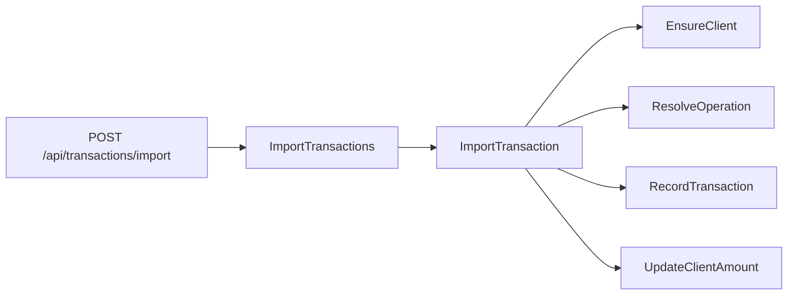

# Backend

API que importa movimentações financeiras de lojas a partir de um arquivo CNAB, guarda o saldo de cada cliente e devolve essas informações para a interface.

O enunciado do desafio está no [README da raiz](../README.md). Este documento descreve só a API: o problema que ela resolve, a stack, os princípios que o código segue e como consumir os endpoints.

## O problema

O arquivo CNAB é texto de largura fixa. Cada linha é uma movimentação de uma loja.

| Campo | Posição | Tamanho | Significado |
| --- | --- | --- | --- |
| Tipo | 1–1 | 1 | Código da operação (1 a 9) |
| Data | 2–9 | 8 | `YYYYMMDD` |
| Valor | 10–19 | 10 | Centavos. Dividir por 100 antes de enviar à API |
| CPF | 20–30 | 11 | Beneficiário |
| Cartão | 31–42 | 12 | Cartão da transação |
| Hora | 43–48 | 6 | `HHMMSS`, fuso UTC-3 |
| Dono da loja | 49–62 | 14 | Nome do representante |
| Nome da loja | 63–81 | 19 | Nome da loja |

A natureza do código vem do catálogo de operações, semeado no banco:

| Código | Descrição | Efeito no saldo |
| --- | --- | --- |
| 1 | Débito | Entrada |
| 2 | Boleto | Saída |
| 3 | Financiamento | Saída |
| 4 | Crédito | Entrada |
| 5 | Recebimento Empréstimo | Entrada |
| 6 | Vendas | Entrada |
| 7 | Recebimento TED | Entrada |
| 8 | Recebimento DOC | Entrada |
| 9 | Aluguel | Saída |

A interface faz o parse do arquivo e envia todas as linhas num JSON já normalizado. A API não lê o arquivo. Ela encontra ou cria o dono, o cliente e a loja, aplica o sinal da operação ao saldo e grava as movimentações. O mesmo CPF na mesma loja reutiliza o cliente. O mesmo CPF noutra loja cria outro cliente. Se uma linha do lote tiver um código desconhecido, nenhuma linha desse pedido fica gravada.

## Tecnologias

| Peça | Uso |
| --- | --- |
| PHP 8.1 | Linguagem |
| Laravel 8 | HTTP, Eloquent, migrations, fila de exceções |
| Spatie Laravel Data 1.x | DTOs com validação nas propriedades |
| MySQL 8 | Banco `challenge` no Compose |
| PHPUnit 9 | Testes de domínio em SQLite na memória |
| Docker Compose | API na porta `8084`, MySQL na `3306` |

`app/` é a casca do Laravel: Kernel, middleware, providers e o handler de exceções. A regra de negócio vive em `src/Domain`.

## Princípios

O código é escrito para um desafio pequeno, com as mesmas regras que um assistente deve respeitar ao alterar este backend. Elas estão em `.cursor/rules/`.

- **Simplicidade.** Uma classe faz uma coisa. Não há camada extra para um fluxo que cabe numa Action.
- **Inglês no código.** Classes, métodos, tabelas, colunas, logs e exceções estão em inglês. Este README e a interface ficam em português.
- **Limite de contexto.** `Client` não lê `Transaction`. `Transaction` não altera o saldo do cliente. O único lugar que junta os dois é o orchestrator de importação.
- **DTO na fronteira.** O controller valida com `Data::validate()` e entrega um objeto à Action. A validação está nas propriedades (`Required`, `Max`, `Numeric`), não num Form Request.
- **Envelope.** Toda resposta de sucesso ou erro de domínio usa `data`, `message`, `code`, `status_code` e `errors`.
- **Exceção de domínio.** `ClientNotFoundException` e as equivalentes estendem `DomainException`. O handler monta o envelope. O controller não captura 404.
- **Teste ao lado da regra.** Cada contexto tem os seus testes no padrão Arrange, Act, Assert.

## Arquitetura

```text
src/Domain
├── Client          dono, cliente, loja e saldo
├── Transaction     movimentação e catálogo de operações
├── Orchestrator    ponte entre contextos, sem model próprio
│   └── Import
└── Shared          DomainException
```

`User` e `Store` não são domínios. São a persistência do nome do dono e do nome da loja dentro de `Client`. `Operation` também não é um domínio: é o catálogo dentro de `Transaction`.



`ImportTransactions` percorre o lote dentro de uma transação de banco e, no fim, devolve os clientes e as movimentações visíveis. Cada linha passa por `ImportTransaction`. Se o código da operação não existir, o lote inteiro é desfeito.

`DELETE /api/transactions` não apaga a linha. `SoftDeleteTransactions` preenche `deleted_at`. A listagem e o detalhe ignoram essas linhas. O catálogo de operações não entra nesse soft delete.

O saldo novo é o saldo atual menos o valor quando a operação é saída (`type` 0) e mais o valor quando é entrada (`type` 1).

## Como executar

Na raiz do repositório:

```bash
make up
```

O entrypoint espera o MySQL, gera a `APP_KEY` se faltar, corre as migrations e semeia as operações 1–9 na primeira subida. A API fica em `http://localhost:8084`.

```bash
make test
make migrate
make down
```

As credenciais de exemplo estão em [`.env.example`](.env.example). Os testes não usam esse MySQL: o PHPUnit sobe um SQLite em memória.

## API

Base: `http://localhost:8084/api`.

Toda resposta de negócio tem esta forma:

```json
{
  "data": {},
  "message": "Clients listed successfully.",
  "code": "CLIENTS_LISTED",
  "status_code": 200,
  "errors": []
}
```

`data` é o recurso, ou uma lista de recursos. Num erro de domínio, `data` vem `null` e o HTTP segue `status_code`.

### Endpoints

| Método | Caminho | Código | O que devolve |
| --- | --- | --- | --- |
| `GET` | `/clients` | `CLIENTS_LISTED` | Lista de clientes |
| `GET` | `/clients/{id}` | `CLIENT_FOUND` | Um cliente |
| `GET` | `/transactions` | `TRANSACTIONS_LISTED` | Movimentações visíveis, sem soft delete |
| `GET` | `/transactions/{id}` | `TRANSACTION_FOUND` | Uma movimentação visível |
| `POST` | `/transactions/import` | `TRANSACTIONS_IMPORTED` | Importa o arquivo inteiro e devolve clientes e movimentações |
| `POST` | `/transactions` | `TRANSACTION_RECORDED` | Importa uma linha já normalizada |
| `DELETE` | `/transactions` | `TRANSACTIONS_HIDDEN` | Soft delete das movimentações visíveis |
| `GET` | `/operations` | `OPERATIONS_LISTED` | Catálogo 1–9 |
| `GET` | `/operations/{id}` | `OPERATION_FOUND` | Uma operação do catálogo |

### Cliente

`name` é o dono da loja. `store_name` é o nome da loja. O saldo fica em `amount`.

```json
{
  "id": 1,
  "cpf": "09620676017",
  "card": "4753****3153",
  "amount": 100,
  "name": "João macedo",
  "store_name": "Bar do joão"
}
```

### Movimentação

A descrição da operação já vem achatada. Não há objeto aninhado de cliente nem de loja.

```json
{
  "id": 1,
  "client_id": 1,
  "value": 100,
  "amount": 100,
  "date_at": "2019-03-01 00:00:00",
  "hour_at": "15:34:53",
  "description": "Débito",
  "type_description": "Entrada"
}
```

### Importar o arquivo

O corpo é uma lista. `value` já está em reais. O campo de centavos do arquivo foi dividido por 100 antes deste pedido. `type` é o código CNAB, de 1 a 9. `date_at` aceita `YYYYMMDD` ou uma data normal. `hour_at` aceita `HHMMSS`.

`data.clients` e `data.transactions` são as listas visíveis depois da gravação. A interface monta o ecrã com essa resposta.

```bash
curl -s -X POST http://localhost:8084/api/transactions/import \
  -H 'Content-Type: application/json' \
  -d '[
    {
      "cpf": "09620676017",
      "card": "4753****3153",
      "date_at": "20190301",
      "hour_at": "153453",
      "name": "JOÃO MACEDO",
      "store_name": "BAR DO JOÃO",
      "type": 1,
      "value": 100
    }
  ]'
```

### Importar uma linha

O `POST /api/transactions` grava um objeto só e devolve essa movimentação em `data`. O ecrã usa o lote, não esta rota.

```bash
curl -s -X POST http://localhost:8084/api/transactions \
  -H 'Content-Type: application/json' \
  -d '{
    "cpf": "09620676017",
    "card": "4753****3153",
    "date_at": "20190301",
    "hour_at": "153453",
    "name": "JOÃO MACEDO",
    "store_name": "BAR DO JOÃO",
    "type": 1,
    "value": 100
  }'
```

A primeira linha com aquele CPF e aquela loja cria o dono, o cliente e a loja com saldo zero e depois aplica o movimento. Outra linha com o mesmo par reutiliza o cliente. O nome da loja gravado é o de `store_name`, não o nome do dono.

### Esconder movimentações

```bash
curl -s -X DELETE http://localhost:8084/api/transactions
```

A resposta traz `data` vazio e o código `TRANSACTIONS_HIDDEN`. Cada linha visível passa a ter `deleted_at`. `GET /api/transactions` deixa de as listar. O cliente, a loja e o catálogo de operações permanecem.

### Operação

`type` 1 é entrada. `type` 0 é saída.

```json
{
  "id": 1,
  "code_operation": 1,
  "description": "Débito",
  "type_description": "Entrada",
  "type": 1
}
```

### Erros de domínio

| Situação | HTTP | `code` |
| --- | --- | --- |
| Cliente inexistente | 404 | `CLIENT_NOT_FOUND` |
| Movimentação inexistente | 404 | `TRANSACTION_NOT_FOUND` |
| Operação inexistente na consulta por id | 404 | `OPERATION_NOT_FOUND` |
| Código CNAB fora do catálogo, numa linha ou no lote | 422 | `OPERATION_NOT_FOUND` |
| Movimentação já escondida, na consulta por id | 404 | `TRANSACTION_NOT_FOUND` |

```json
{
  "data": null,
  "message": "Operation not found.",
  "code": "OPERATION_NOT_FOUND",
  "status_code": 422,
  "errors": []
}
```
