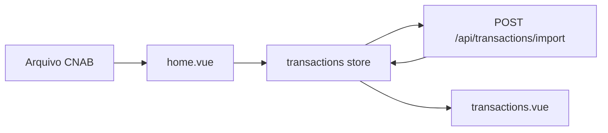

# Frontend

Interface que lê um arquivo CNAB, envia as movimentações numa única requisição e mostra o saldo de cada loja.

O enunciado do desafio está no [README da raiz](../README.md). A API está descrita no [README do backend](../backend/README.md). Este documento cobre só o ecrã: o que ele resolve, a stack, os princípios e como os pedidos se ligam aos domínios.

## O problema

O utilizador escolhe o arquivo de texto. Cada linha tem largura fixa: tipo, data, valor em centavos, CPF, cartão, hora, dono da loja e nome da loja. A interface parte a linha, divide o valor por 100 e junta todas as linhas num JSON.

Esse JSON vai inteiro em `POST /api/transactions/import`. A API valida o lote, grava numa transação e devolve o envelope com `clients` e `transactions`. O ecrã monta os cartões a partir dessa resposta. Não há um pedido por linha.

Sem movimentações visíveis, a página mostra **Importe os dados para visualizar.**

**Limpar** chama `DELETE /api/transactions`. A API faz soft delete: as linhas ficam na tabela com `deleted_at` e somem da listagem, também depois de recarregar. O saldo de cada cartão é a soma só do que está visível.

## Tecnologias

| Peça | Uso |
| --- | --- |
| Vue 3 | Interface |
| TypeScript | Contratos do envelope e das linhas do arquivo |
| Vuex 4 | Estado de clientes e de movimentações |
| Vue Router 4 | Rota `/` |
| Axios | HTTP para `http://127.0.0.1:8084/api/` |
| Docker Compose | Ecrã na porta `8080` |

A base da API está em [`src/http/index.ts`](src/http/index.ts).

## Princípios

As mesmas regras de `.cursor/rules/` valem aqui. O código fica em inglês. Os textos do HTML ficam em português.

- **Um pedido para o arquivo.** Ler, validar no backend e pintar a resposta. A store não dispara `GET` a cada linha.
- **Envelope.** Toda resposta usa `data`, `message`, `code`, `status_code` e `errors`. A store lê `response.data.data`.
- **Contrato plano.** Cliente é `id`, `cpf`, `card`, `amount`, `name`, `store_name`. Movimentação é `id`, `client_id`, `value`, `amount`, `date_at`, `hour_at`, `description`, `type_description`. Não há `users` nem `stores` aninhados.
- **Limite de contexto.** Clientes e movimentações são módulos separados. O cruzamento dos dois acontece no import, que grava as duas listas a partir de uma resposta só.

## Arquitetura

```text
src
├── http/index.ts                         axios e ApiEnvelope
├── pages/home/home.vue                   lê o CNAB e dispara o import
├── pages/transactions/transactions.vue   cartões por loja
└── store/modules
    ├── clients/clients.ts                GET /api/clients
    └── transactions/transactions.ts      import, listagem e soft delete
```



Ao abrir a página, a lista pede `GET /api/clients` e `GET /api/transactions` uma vez. O import seguinte não repete esses GET: usa o corpo do `POST`.

| Ação no ecrã | Pedido | Quem trata |
| --- | --- | --- |
| Abrir a página | `GET /api/clients` e `GET /api/transactions` | módulos `clients` e `transactions` |
| + Nova Transação | `POST /api/transactions/import` | `importTransactions` |
| Limpar | `DELETE /api/transactions` | `clearImportedData` |

## Como executar

Na raiz do repositório, com a API no ar:

```bash
make up
```

O ecrã fica em `http://localhost:8080`. Fora do Compose:

```bash
npm install
npm run serve
```

A API precisa estar em `http://127.0.0.1:8084`. Para apontar outro host, altere `baseURL` em [`src/http/index.ts`](src/http/index.ts).
